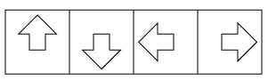
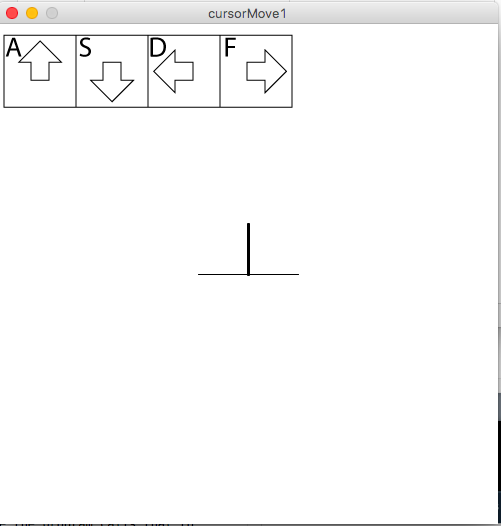
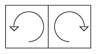
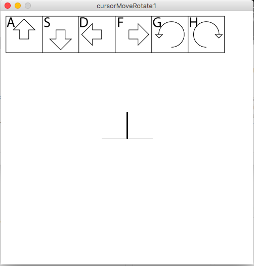

# Fourfold symmetry

Begin with a simplified set of commands designed to teach four fold symmetric construction.

The first command does nothing this case since we're only using four fold symmetry, and it sets symmetry to four fold.  The glyph for this is:

The octal address for this command is 0304.  That is a base 8 number, and the leading 0 indicates that for the Processing language which I use throughout this documentation.  So to translate this to the more familiar base 10 we multiply 64 by 3 and add 4 to get 3*64 + 4 = 192 + 4 = 196.  All the commands of this type go in the 0300s in the octal address space, and the row 0300 through 0307 is mostly symmetries, with the 4 indicating four fold symmetry.  There is no direct correlation between symmetry and number, but they sort of roughly line up.  This is in line with the overall philosophy here that everything should be as obvious and easy to remember as possible.  

The meaning of this command if you're doing this by hand or building a machine is that all rotations and motions will be on a grid with 4 fold symmetry, or a square grid.  Later on we'll use square grids of different sizes but for now this sets us on a single square grid.  The meaning when implemented in software is that we set the global variable thetaStep to one quarter of a full rotation, or 90 degrees.  In processing the default angle units are radians, where 2*PI is a full rotation so this is PI/2.  Or in code

	void doTheThing(int localCommand){
		if(localCommand == 0304){
			thetaStep = PI/2;
		}

	}

Note that each command gets put into this master function, which we'll be duplicating in many different languages and machines in the future.  It is a generic language processing function that the whole rest of our language will be based on.  I use here the so-called "camel case" common to Java based languages of which Processing is one(sticking a bunch of words together with the first letter of all BUT the first one capitalized). 
 
OK!  Now we have set fourfold symmetry and discussed what that means and how it goes into our language.  Now we need to introduce the cursor.  This language will be used somewhat interchangeably with some other words depending on the context.  We'll use "cursor" most of the time in the computer software code but in physical implementations "tool" will be a better word to describe this entity.  The simplified cursor for this first version looks like this:

For the fourfold symmetric grid with no zoom the cursor consists of three line segments separated by 90 degrees, the middle of which is of a thicker line width than the others.  This is meant to denote the primary directions of motion and the directions the cursor can be made to point with single rotations.  The length of each line segment is determined by another global variable called "side", which we will be using constantly in this language.  We will be using numerous global variables in spite of(because of?) the constant demands to not do that by members of the computer "science" priesthood.  Global variables best represent how the world we deal with actually works so we use them as needed to relate to that world.  The direction of the thicker middle line is determined by the global variable "theta", an angle measured relative to the fixed angle, a global constant "theta0," which we have pointing up here for clarity relative to the movement glyphs(it will be moved in some cases for various languages which go in different directions).  

The position of the intersection of these line segments is described on either the physical workspace or the software canvas by global variables x and y.  We now four move commands to be able to make the cursor actually do something.  The four move commands are denoted by arrows, and there are several artistic ways to do this but whatever we choose it should be something thick to distinguish from the line command.  A reasonable set might be:

These arrows should be clear to pretty much anyone in the world as denoting motion of the cursor up, down, left and right.  The octal addresses of these commands are 0330, 0331,0332, and 0333 respectively.  

We are now ready for the first program, which will just move the cursor around.  The language needed to do this has only these four commands, along with the previous command so now the main language processing function is

	void doTheThing(int localCommand){
		if(localCommand == 0304){
			thetaStep = PI/2;
		}
		if(localCommand == 0330){
			x += side*cos(theta);   
			y += side*sin(theta); 
		}
		if(localCommand == 0331){
			x -= side*cos(theta);   
			y -= side*sin(theta); 
		}
		if(localCommand == 0332){
			x += side*cos(theta - thetaStep);
			y += side*sin(theta - thetaStep);
		}
		if(localCommand == 0333){
			x += side*cos(theta + thetaStep);
			y += side*sin(theta + thetaStep);
		}
	}
	
	
where we've added sin and cos as needed to make this more general for other values of theta and thetaStep.  

Now we also need a function that draws the cursor, which is as follows:

	void drawCursor(){
		strokeWeight(3);
		line(x,y,x + side*cos(theta),y + side*sin(theta));
		strokeWeight(1);
		line(x,y,x + side*cos(theta + thetaStep),y+side*sin(theta + thetaStep));
		line(x,y,x + side*cos(theta - thetaStep),y+side*sin(theta - thetaStep));
    }
    
All this is put together to make a standalone app which can run on the mac or pc, which is in subdirectories of this repository.  Note that the .png file in each folder MUST be included if you're going to run this on your machine, since the program calls that to remind the user which key is which.  The actual keys are connected with commands using the "keyPressed" built in function in Processing. 

Here is a screenshot of that standalone app:

The next thing to do is to add two more simple geometric operations: rotations.  As with movements, rotations are always discrete, and are based on the global variable thetaStep, which gets either added or subtracted from theta to reset the direction of the cursor.  Note that one annoying feature of processing is that the vertical direction we call "y" is measured from the top of the screen rather than the bottom, making it opposite from pretty much all of standard math, map making, art, and common sense, for unknown reasons.  Maybe this makes sense to computer "scientists," who knows, but it means some care must be taken with signs in this next step. In the end all that matters is that the glyphs and the actions line up.  This is an example of why it's so powerful to use a number and language independent system of glyphs: the glyph describes a direction in the same space as the actual thing that will be doing the action, so it's either right or wrong. 

The glyphs for rotations are as follows:

We now add the following two functions to "doTheThing()":

	if(localByte == 0334){
		theta -= thetaStep; // CCW
	}
	if(localByte == 0335){
	    theta += thetaStep; // CW
	}

and the addresses in octal space for these are right along the same row as the previous four commands.  We thus add them to keyPressed() as the G and H keys, and create another version of the standalone Geometron program.  Here is a screenshot of that:

 

Now things have gotten more complex but also more powerful.  You can use the "g" and "h" keys to rotate the cursor around.  But as you rotate it note that the arrow keys are no longer simply "up", "down", "left" and "right" relative to the screen.  They are relative to the _cursor_, meaning that the "a" key will move the cursor wherever the larger and middle of the three line segments points.  As you rotate the cursor around that will go to all four of the major directions.  It's the same logic used for a lot of video games: think of the cursor as a playable character which can point in a given direction and the arrows as always being relative to that character.  

Try the following with the app: "a,g,a,g,a,g,a,g". This sequence will move the cursor around the edges of a square of length "side", and return it to where it started in its original orientation, while using only one movement and one rotation.  If we wanted to make the same motion while always pointing the cursor "up", we could instead do the sequence "a,d,s,f".  It starts the same, ends the same, but never rotates the cursor.  All this seems overly complex now, but it adds to the power of what we're building, allowing for a much larger set of possibilities later on.  

Finally this version of the standalone app, which again is compiled for both the mac and the pc, has added the "pac man metric", allowing the cursor to disappear from one side of the screen and reappear on the other, to prevent the user from wandering off the screen and getting lost.  Also note that if you download the actual .app or .exe file you must also get the .png file which it requires in order to display the key guide as shown in the screen shot.  All this is in the directory called "cursorMoveRotate1".  

This concludes the introduction to fourfold symmetry in the Geometron language.  You now have glyphs which describe relative motion of a cursor and a glyph describing the concept of fourfold symmetry.  The next step will be to add some actual art actions, drawing lines and circles and arcs, as well as creating compound glyphs, which is where the real power of this language becomes evident.  That will go in the next section.  

For completeness, I will include links to the code for the two apps used here:

[cursorMove1.pde](cursorMove1/cursorMove1.pde)

[cursorMoveRotate1.pde](cursorMoveRotate1/cursorMoveRotate1.pde)

	

