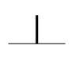

# Fourfold symmetry

Begin with a simplified set of commands designed to teach four fold symmetric construction.

The first command does nothing this case since we're only using four fold symmetry, and it sets symmetry to four fold.  The glyph for this is:

The octal address for this command is 0304.  That is a base 8 number, and the leading 0 indicates that for the Processing language which I use throughout this documentation.  So to translate this to the more familiar base 10 we multiply 64 by 3 and add 4 to get 3*64 + 4 = 192 + 4 = 196.  

The meaning of this command if you're doing this by hand or building a machine is that all rotations and motions will be on a grid with 4 fold symmetry, or a square grid.  Later on we'll use square grids of different sizes but for now this sets us on a single square grid.  The meaning when implemented in software is that we set the global variable thetaStep to one quarter of a full rotation, or 90 degrees.  In processing the default angle units are radians, where 2*PI is a full rotation so this is PI/2.  Or in code

	void doTheThing(int localCommand){
		if(localCommand == 0304){
			thetaStep = PI/2;
		}

	}

Note that each command gets put into this master function, which we'll be duplicating in many different languages and machines in the future.  It is a generic language processing function that the whole rest of our language will be based on.  I use here the so-called "camel case" common to Java based languages of which Processing is one(sticking a bunch of words together with the first letter of all BUT the first one capitalized). 
 
OK!  Now we have set fourfold symmetry and discussed what that means and how it goes into our language.  Now we need to introduce the cursor.  This language will be used somewhat interchangeably with some other words depending on the context.  We'll use "cursor" most of the time in the computer software code but in physical implementations "tool" will be a better word to describe this entity.  The simplified cursor for this first version looks like this:

For the fourfold symmetric grid with no zoom the cursor consists of three line segments separated by 90 degrees, the middle of which is of a thicker line width than the others.  This is meant to denote the primary directions of motion and the directions the cursor can be made to point with single rotations.  The length of each line segment is determined by another global variable called "side", which we will be using constantly in this language.  We will be using numerous global variables in spite of(because of?) the constant demands to not do that by members of the computer "science" priesthood.  Global variables best represent how the world we deal with actually works so we use them as needed to relate to that world.  The direction of the thicker middle line is determined by the global variable "theta", an angle measured relative to the fixed angle, a global constant "theta0," which we will generally have pointed to the right, at least when we're using this system with human languages written from left to right(so for Arabic or Hebrew the sign of theta0 will reverse and for traditional Chinese that is written vertically it will point down the page).  

The position of the intersection of these line segments
