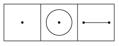
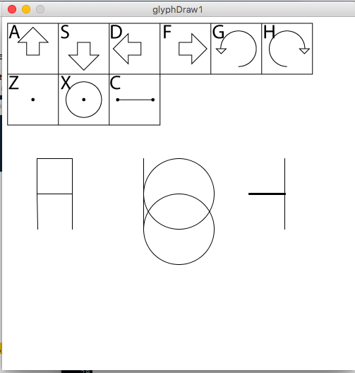
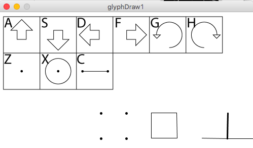
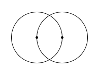

# Glyph of Glyphs(Fourfold 2)

So far a glyph has been just a symbol, made with some art program, denoting a geometric operation or concept.  In this section we add to the language by making glyphs that are composed of glyphs.  The component glyphs are operations as defined in the previous section.  In that section we simply hit keys on the computer keyboard and they made an operation happen, moving the cursor around by changing the global variables that determined its position.  In each iteration of the draw() function we blanked the screen and redrew the cursor with whatever its current status happened to be.  Now we're going to add a drawGlyph() function that will act on an array of commands, which can be represented by glyphs, drawing out a shape on the screen, which can be thought of as a glyph of glyphs.  

This represents a first step in adding the layers that will be needed to build a real language.  For now, the glyphs that make up the glyph shown on the screen will be held in your computer's memory, and not spelled out on the screen, but we'll be adding that function later, because that will require another layer of glyphs-within-glyphs.  

Before we build up glyphs we need to add some actual drawing operations so that something is displayed on the screen.  We're also going to add "reset" and "delete" functions since those will make the creation process much more pleasant.  

The first operations are point, line and circle.  In all cases, as before, everything is _relative_ to the current cursor status.  So the line is along the position of the thicker middle line, the circle is of radius "side" and center position (x,y), and the point is just a thick point at (x,y).  

These functions are added using the built in Processing functions along the beginning of the 034x row of octal command addresses as follows:

	if(localCommand == 0340){
      strokeWeight(5);
      point(x,y);
      strokeWeight(1);//point
    }
    if(localCommand == 0341){
    	ellipse(x,y,2*side,2*side);//circle
	}
    if(localCommand == 0342){
      line(x,y,x + side*cos(theta),y + side*sin(theta));//line
    }
    
    

As with the move functions the line function uses sin and cos to make the direction easily generalize to other angles and symmetries, which will be useful later.  

The glyphs for these operations are as self-describing as possible, and are a point, circle with a point and line with two points to distinguish it from other similar glyphs we'll use later.  

As before these will be assigned keys that line the geometry of a QWERTY keyboard up with the grid of octal commands with the ones determining how far in we are from the left and the eights determining the row(now incremented by one), and as before all commands are in the 0300s.

Now for the main point of this section: the glyph of glyphs.  Since each command is an integer number, this is an array of integers, declared in the code as follows:

	int[] currentGlyph = {};

This declaration makes an array of length zero. Each time we hit a key we want to add one integer command to this, thus increasing the length by one.  The soon-to-be-added "delete" command will remove one integer from the end of the array, the element at array index 0 in Processing.

In this incarnation of Geometron we don't want to just do a thing when you hit a key anymore.  Instead we want each keystroke to add an element to the glyph array, and for that glyph array to just get drawn over and over in the draw() function(which runs forever).  So keyPressed has a bunch of "append" statements instead of doTheThing(), and doTheThing gets put inside a new function called drawGlyph().

	 if(key == 'z'){
	     currentGlyph = append(currentGlyph,0340);
	 }
	 if(key == 'x'){
    	 currentGlyph = append(currentGlyph,0341);
     }
     if(key == 'c'){
     	 currentGlyph = append(currentGlyph,0342);
     }
  
Are the new commands, and the old ones are also updated to use "append" instead of "doTheThing".  Now we must add the "drawGlyph()" function, the next most important function in Geometron after doTheThing(). This uses the for loop as follows:

	void drawGlyph(int[] localGlyph){
		for(int index = 0;index < localGlyph.length;index++){
    		doTheThing(localGlyph[index]);  
    	}  
    }
    
This is just a few lines of code but this vastly increases the power of what we can do. In order to make all this useful we need to also have a reset command that puts the cursor back at a "zero" point on each drawing, so that the glyph always starts at the sam point. Otherwise the movement operations will just move the cursor all over the place forever.  To do this we add global variables x0 and y0 which are at the center of the screen, reset the angle theta, and make the command at octal address 0300 relocate x and y to these as follows:

    if(localCommand == 0300){
      x = x0;
      y = y0;
      theta = theta0;
    }

Then we want run this command on each iteration of draw(), then draw the currentGlyph, the draw the cursor as it looks after the last of the commands in that array:

	void draw(){
		 background(255);
		 doTheThing(0300);
		 drawGlyph(currentGlyph);
		 drawCursor();
    }

Finally we want to add two key commands, one for reset and one for delete.  Delete will use the "shorten" command from Processing to just remove one element from the array, and will run when we hit the "delete" key on the keyboard.  Reset will happen when we hit the zero key.
	
	if(key == '0'){
    	currentGlyph = append(currentGlyph,0300);   
    }
    if(key == 8){ //delete key
	    if(currentGlyph.length != 0){
    		currentGlyph = shorten(currentGlyph);
    	}
    }
  
Finally we draw the image reminding the user of the key assignments on every iteration of draw as follows:

	 image(loadImage("firstDrawGlyphs.png"),0,0,447,163);

Here is a screenshot of this program:

Here I've started to draw a very crude English alphabet.  To get started with this, as before, you want to make sure the .app or .exe files are in the same directory as the image file firstDrawGlyphs.png, which they should be if you download everything together.  Then you should be able to click on the app and just hit keys and see what happens.  

To see exactly what has happened here it helps to go back to the examples from the previous section.  All the cursor movements are identical but now we can add draw commands.  Try the square motion from the previous section but add a point with the following key sequence: z,a,g,z,a,g,z,a,g,z,a,g,f,f.  Now the cursor moves along the same square trajectory as before but it leaves behind a point at each location, making a square arrangement of points.  Now repeat this with "c" instead to make lines as follows:  c,a,g,c,a,g,c,a,g,f,f.  This should give a square!  Now we're starting to build useful things, which as we'll see in the next section is how we move into recursion, which will give yet another vast increase in power available.  

This screenshot shows what the above command sequences will produce:

Now to play with circles.  The first thing to make is the so-called "vesica pisces," a famous figure from classical geometry consisting of two circles, each centered on the other.  This is the basis of numerous compass-and-straightedge constructions. To make this, marking the center of each circle we can enter the following command sequence: z,x,f,z,x,f,f,f.  This makes two circles centered on each other and moves the cursor out of the way, which should make the following figure:

Simple!  Now try making all sorts of things, using the delete key to remove commands as needed, and zero to move back to the beginning as needed.  

