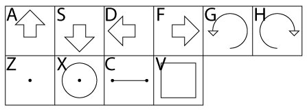
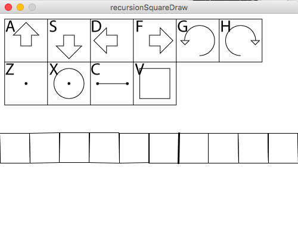

# Recursion: Making a Square

Recursion is when a function calls itself. It can create many layers of abstraction and is what allows us to build extremely powerful and complex linguistic structures from an extremely simple base layer.  

In this section we will use recursion to add another command and glyph: drawing a square using only the commands covered already in this work.  This is remarkably simple: take the sequence of commands used to make a square, which is a sequence of rotations, lines, and movements, put them in a local array, and call that array with the drawGlyph() function as follows.

    if(localCommand == 0360){
       int[] localGlyph = {0304,0342,0330,0334,0342,0330,0334,0342,0330,0334,0342,0330,0334}; 
       drawGlyph(localGlyph);
    }
    
Then we add a key to the keyPressed function to get 
	
	
    if(key == 'v'){
     	currentGlyph = append(currentGlyph,0360);         
    }

And what is the glyph that represents a square? It's just a slightly smaller square inside the larger boundary square, which is added to the command set as follows:

It is now easy to draw many squares all over the place.  In the following screen shot, we enter the key sequence v,d,v,d,v,d,v,d,v,d... to get a whole row of squares which wraps around the screen. 

Perhaps this is not that impressive, and of course it's short.  But by adding recursive calling of a function we are unleashing what will become massive power in a few more steps.  Run the app and play with it.  You can draw some mildly interesting things here at least.  

