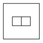
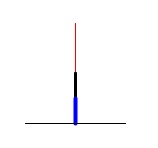
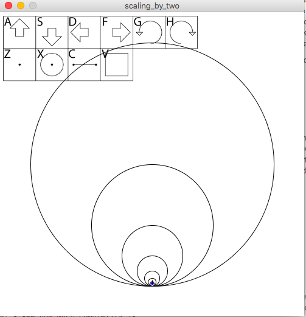
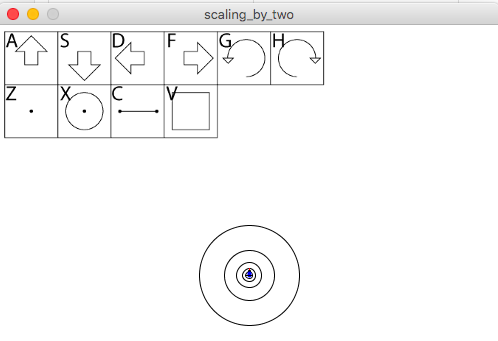
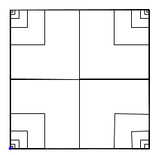
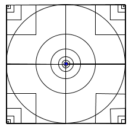
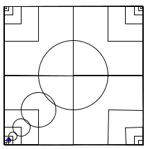
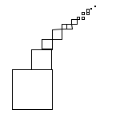
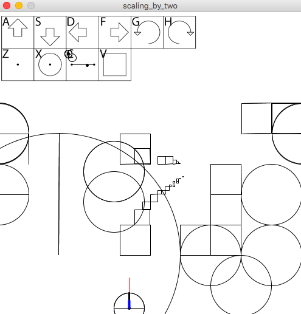

# Scaling by Two: Doubling and Halving

In this section we introduce three more glyph commands: zoom in, zoom out, and set scaleFactor to two. ScaleFactor is another global variable that we use in the whole geometron system.  It does exactly what it sounds like: sets the factor by which we scale up and down.  Unlike in many systems on computers, zooming up and down in scale is always done in discrete jumps, and there are several distinct ways this is done depending on the geometry we are working with.  For simple square geometry as well as triangular and a lot of other work, the factor of two is by far the most important.  

The glyph to denote the concept of factors of two is just two squares stacked side by side as follows:

Just as the cursor we have used so far has shown where it would go if discrete rotations or motions are applied, the cursor should now also show what will happen to it if discrete scale factors are applied.  We use red and blue to indicate longer and shorter lengths respectively.  As with the other global settings this is important because later it will e set to other values besides 2 so we need the cursor to be able to denote which setting it currently is.  

Also, we need to add both the global variable scaleFactor and unit, which will be the starting length of "side" that we'll be resetting to when we carry out the reset command 0300.  Thus we add to the beginning of our program:

	float scaleFactor, unit;

and in the setup() function we set

	scaleFactor = 2;
	unit = 50;
	
Then we modify the reset function as follows:

	side = unit;
	
And then the new version of the cursor code is as follows:

	void drawCursor(){
    	stroke(color(255,0,0));
    	line(x,y,x + scaleFactor*side*cos(theta),y+scaleFactor*side*sin(theta));
    	strokeWeight(3);
    	stroke(0);
    	line(x,y,x + side*cos(theta),y + side*sin(theta));
    	stroke(color(0,0,255));
    	strokeWeight(4);
    	line(x,y,x + (side/scaleFactor)*cos(theta),y+(side/scaleFactor)*sin(theta));
    	strokeWeight(1);
    	stroke(0);
    	line(x,y,x + side*cos(theta + thetaStep),y+side*sin(theta + thetaStep));
    	line(x,y,x + side*cos(theta - thetaStep),y+side*sin(theta - thetaStep));
    }
    
Of course by itself this newly designed cursor doesn't do anything, it just carries a little bit of not-yet-relevant information, the values of side*scaleFactor and side/scaleFactor, where scaleFactor is always 2.  So now we need to add the zoom in and zoom out glyphs which are just a "+" and "-".  In this case the glyph is so simple and the key on the keyboard that corresponds to it is so literal that we won't bother making a glyph for the command key, and we'll just connect the "+" and "-" keys with the zoom functions.  Note that to avoid having to use shift every time we zoom up, we'll use the key value "=" to denote plus instead of actual "+".  

Now what remains is to add these commands to doTheThing(), and they will go at 0336(-) and 0337(+):

    if(localCommand == 0336){
      side /= scaleFactor; // -
    }
    if(localCommand == 0337){
      side *= scaleFactor; // +
    }

And then we add to the keyPressed() function as follows:
	
	 if(key == '-'){
     	currentGlyph = append(currentGlyph,0336);               
     }
     if(key == '='){
     	currentGlyph = append(currentGlyph,0337);               
     }
 
Note that we really have not added much code here.  But let's see how much complexity is added.  If we run the program then enter the key sequence: +,+,-,s,x,-,s,x,-,s,x,-,s,x,-,s,x,-,s,x,-,s,x we get the following fascinating diagram:

So now we can make fractals, and just by using four commands!  Or even simpler just repeat zoom and circle a bunch of times: x,-,x,-,x,-,x,-,x to get 

So simple and yet so powerful!  And let's not forget the square.

