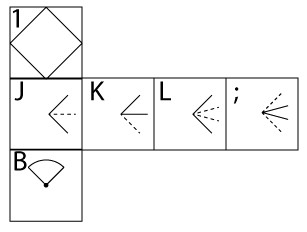
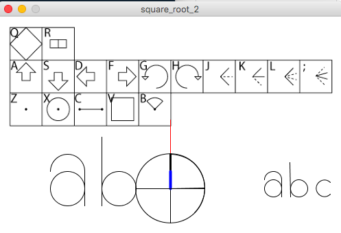
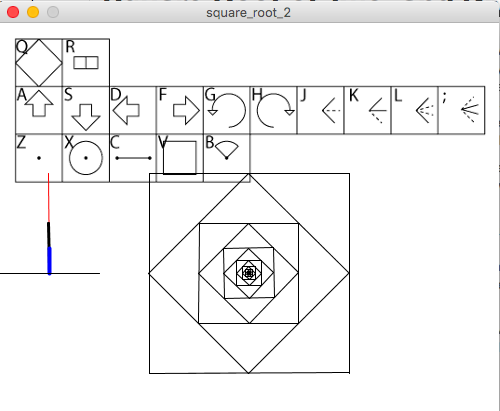
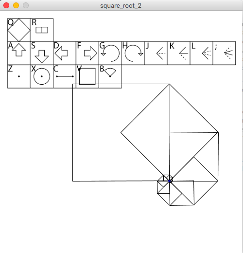

# Square Root of Two, and Divided Angles

It's time to add more flexibility to the system of angles.  To that end, we're going to add two more angle manipulation commands, one which divides the current thetaStep by two and one which multiplies by 2.  Note that since we're starting with thetaStep being always 90 degrees, the first application of this is to divide by 2 to get a 45 degree angle.  That is very useful!  If we also add a divide by 3 and multiply by 3, we can get most of the angles we care about, such as 30 degrees and 60 degrees as well.  In addition to these we will add one more drawing command, which will draw an arc across the span of the cursor.  

Also, note that since the main point of this section is to add 45 degree angles we are going to really want to be able to multiply and divide by factors of the square root of two.  This will make it easy to make isosceles right triangles of all sizes and angles.   

So in total we are adding 6 commands: halve angle(bisect), double angle, trisect angle, triple angle, draw arc, and set scaleFactor to sqrt(2).  Each of these will need its own glyph.  The angle manipulation commands will all go in the 0350's row of the octal address space.  Draw arc lives on the 0340's line next to the other draw commands, and setting multiples for distance all go in the 0310's line below the symmetry settings and operational commands like reset.  

Angle manipulation commands indicate the "from" and "to" angles with solid and dotted lines, respectively, and are drawn to make the proportions as obvious as possible as follows:

    if(localCommand == 0310){
       scaleFactor = sqrt(2); 
    }
    
    if(localCommand == 0343){
        arc(x,y,2*side,2*side,theta - thetaStep,theta + thetaStep);//arc
    }
    
    if(localCommand == 0350){
      thetaStep /= 2;  //angle/2
    }
    if(localCommand == 0351){
      thetaStep *= 2;  //2angle
    }
    if(localCommand == 0352){
      thetaStep /= 3; //angle/3
    }
    if(localCommand == 0353){
      thetaStep *= 3; //3angle
    }

the above adds the six new commands to doTheThing(), and now we add them to keyPressed():

	 if(key == 'j'){
     	currentGlyph = append(currentGlyph,0350);                   
     }
     if(key == 'k'){
     	currentGlyph = append(currentGlyph,0351);                   
     }
     if(key == 'l'){
     	currentGlyph = append(currentGlyph,0352);                   
     }
     if(key == ';'){
     	currentGlyph = append(currentGlyph,0353);                   
     }
     if(key == '2'){
     	currentGlyph = append(currentGlyph,0313);                   
     }
     if(key == '1'){
     	currentGlyph = append(currentGlyph,0310);                   
     }
     if(key == 'b'){
     	currentGlyph = append(currentGlyph,0343);                  
     }

Also we want to add the following line to the 0300 command:

      thetaStep = PI/2;
to make sure each iteration of the glyph starts out clean and the angle does't either infinitely shrink or grow.  

Here's a screenshot:

It is now very straight forward to construct letters in English as well as most other languages.  

#### example: fractal rotated squares

To better see the power of this added set of commands as well as to understand the origin of the glyph we use for the square root of two, we will proceed with a pair of examples which use the above commands by creating new recursive commands as was done in the recursion section.  

First we'll create a new operation which consists of drawing a square, rotating by 45 degrees and shrinking by the square root of 2.  

  r,   -,    a,   j,  g,  q,+,v
{0313,0336,0330,0350,0334,0310,0337,0200}
	
	if(key == 'n'){
     	currentGlyph = append(currentGlyph,0201); 
    }

We also now introduce the shape table, another section of the octal address space that forms the core of this system: the 0200's.  All this will be explained in later sections, but suffice it to say that the 0300's are generally commands that are executed in the language of some machine, the octal values 0040 through 0137 are for ASCII, 0000 through 0037 are for control commands native to Geometron, and the 0200's are for recursive commands that reference each other and the rest of the system.  

Commands in the 0200's are called "shapes" even though they include both actions and shapes, and they are invoked with shift-letters in most cases.  So I insert them with shift-letters going across the top of the keyboard as follows:

	if(key == '!'){
    	currentGlyph = append(currentGlyph,0200);
    }
    if(key == '@'){
     	currentGlyph = append(currentGlyph,0201); 
    }

 
This fractal was made by simply invoking the two elements of the shape table: 0200 and 0201(after using + to increase the size a bit).  Simple!  But how does this work?  Every time we go down one layer of squares we shrink by the square root of 2.  Each square connects the mid points of the sides of the previous square.  It just illustrates the basic principle that any right isosceles triangle always has a hypotenuse that is the square root of two times the length of each of the two legs.  

This brings up one of the points where Geometron diverges from conventional math learning and use.  In school you learn about this triangle and the square root of two, but it's just one of an infinite number of triangles that you might encounter on your homework and exams.  It is not "special" because nothing is special.  Not so in our system of knowledge.  Here this size scale is very special, so special that it gets a whole discussion section and it's own standalone app.  And if you look around you in human society you see that indeed it _is_ special.  The 45 degree angle is everywhere, from decorative tiles to buildings to microcircuit layouts, and in all cases, the square root of two is needed in order to bridge the gap from the right angles to the 45 degree angle sides. And it continues to be useful up to astronomical scales down to atomic scales.  

Our approach to mathematical knowledge is that it is better to master this one triangle in all cases than to learn about a dozen triangles, but have all of them be just dead ideas on a textbook page.  This is _action_ geometry!  

Moving on, the next fractal shape to build with the shape table is an approximation of a binary logarithmic spiral.  This is a very simple combination of the square at 0200 and a rotation and shrinkage again, but with slightly different motions.
  
  j,h,-,!
  0202 = {0350,0335,0336,0200}

    if(localCommand == 0202){
       int[] localGlyph = {0350,0335,0336,0200};
       drawGlyph(localGlyph);
    }

	if(key == '#'){
     	currentGlyph = append(currentGlyph,0202); 
    }

This is made with key sequence: !,#,#,#,...., after a few +'s and some moving the cursor to a good spot:

The detailed study of this spiral will be involved in my mathematical philosophy work that attacks the numerical based system of math.  But this is a story for another time.  

There is one more topic that is of extreme importance for this section: making glyphs to represent glyphs from glyphs.  This will be explored in *much* greater detail later but for now I'm just going to create a couple very simple glyphs and put them in the shape table as a demonstration.  

start with square, or 0200 in the shape table:

r,f,!,-,-,a,d,+,!,-,s,f,+,+

is the key sequence, which is 0200[glyph] = {0313,0333,0200,0336,0336,0330,0332,0337,0200,0336,0331,0333,0337,0337}

 
example: make an arrow glyph
example: make letters

code goes here:

[square_root_2.pde](square_root_2/square_root_2.pde)

